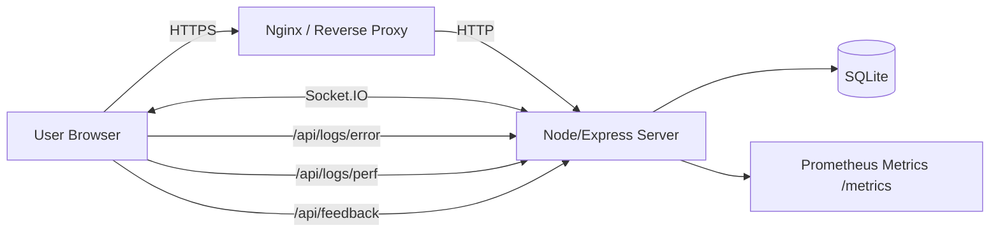
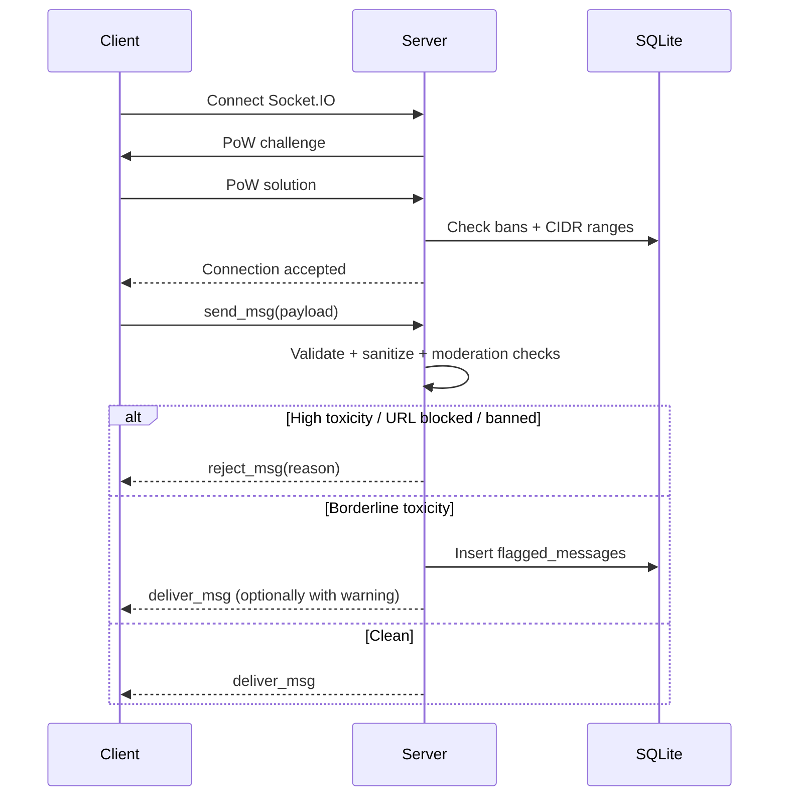

# STRNGR (StrangerChat)

A privacy-first, browser-based anonymous chat app with real-time matching, moderation, admin tools, PWA offline support, and production observability.

> **Goal:** Fast first paint, safe by default, scalable enough for real users, and operable in production (logs, metrics, runbooks).

---

## Features

- **Real-time chat & matching** (Socket.IO)
- **Moderation & safety**
  - Bans, violations, flagged queue (borderline)
  - Link/URL blocking
  - Optional ML toxicity scoring (Perspective API)
  - CIDR range banning
- **Admin panel** for moderation operations
- **PWA**
  - Installable
  - Offline landing page
  - Service worker caching
- **Security hardening**
  - CSP, HSTS, rate limits
  - Proof-of-Work (PoW) challenge for Socket connections
- **Observability**
  - Structured logs
  - Prometheus `/metrics` (protected)
  - Client error + perf reporting endpoints
- **Comprehensive testing**
  - Unit + integration + E2E (Playwright)
  - PWA scenarios
  - Load test script

---

## Tech Stack

- **Frontend:** Vanilla JS (Vite), HTML/CSS, Socket.IO client
- **Backend:** Node.js, Express, Socket.IO
- **DB:** SQLite (WAL), migrations on startup
- **Build:** Vite + legacy support, compression (gzip + brotli)
- **Monitoring:** Prometheus via `prom-client`
- **Testing:** Vitest/Jest (depending on your setup), Playwright

---

## Architecture

### High-level overview



### Chat + moderation flow



---

## Project Structure (important parts)

- `src/server.js` — Express + Socket.IO server, DB init/migrations, security, metrics
- `src/client/index.html` — main client entry
- `src/client/admin.html` — admin UI entry
- `src/client/scripts/app.js` — main UI logic
- `src/client/scripts/chat.js` — chat + socket logic
- `src/client/scripts/admin.js` — admin panel logic (lazy loaded deps)
- `src/client/styles/` — CSS
- `e2e/` — Playwright E2E + PWA tests
- `scripts/` — utilities (load test, image optimization, security checks)

---

## Requirements

- Node.js **18+** (recommended 20+)
- npm **9+**
- (Optional) Nginx for production reverse proxy
- (Optional) Prometheus + Grafana for monitoring

---

## Setup (Development)

```bash
npm install
cp .env.example .env
npm run dev
```

Open: `http://localhost:5173`

---

## Environment Variables

The application is configured using environment variables in a `.env` file. See `.env.example` for a complete template.

### Core Configuration
- `NODE_ENV`: `development` or `production`. Controls logging levels, security flags (like HSTS), and minification.
- `PORT`: The port the Express server will listen on (default: `3000`).
- `BASE_URL`: The public-facing URL of your app (e.g., `https://strngr.chat`).

### Security
- `ADMIN_PASSWORD`: Password for the admin panel and `/metrics` access. **Must be at least 12 characters in production.**
- `SESSION_SECRET`: Random string for signing session cookies and CSRF tokens. **Must be at least 32 characters in production.**
- `TRUST_PROXY`: Set to `true` if behind a reverse proxy (Nginx, Cloudflare).
- `ALLOWED_ORIGINS`: Comma-separated list of allowed CORS/Socket origins.
- `ADMIN_ALLOWED_IPS`: Comma-separated list of IP addresses allowed to access the admin panel.

### Database
- `DB_NAME`: Filename for the SQLite database (saved in `src/db/`).

### Features & Moderation
- `MAINTENANCE_MODE`: Set to `true` to disable matchmaking and show maintenance page.
- `MAINTENANCE_REASON`: Custom message shown during maintenance.
- `HIGH_RISK_COUNTRIES`: JSON array of country codes (e.g., `["CN", "RU"]`) to geo-block.
- `PERSPECTIVE_API_KEY`: Optional key for automated toxicity detection.
- `VAPID_PUBLIC_KEY` & `VAPID_PRIVATE_KEY`: Required for PWA push notifications.
- `MAILTO_ADDRESS`: Contact email for VAPID configuration.

### Logging
- `LOG_LEVEL`: `error`, `warn`, `info`, or `debug`.
- `DEBUG`: Set to `true` for extra verbose terminal output.

---

## Scripts

- `npm test` — unit + integration
- `npm run test:e2e` — Playwright tests
- `npm run test:load` — load test
- `npm run build` — production build

---

## Setup (Production)

For a production-ready deployment, follow these steps:

1.  **Build the Frontend**:
    ```bash
    npm run build
    ```
2.  **Configure Environment**:
    Create a `.env` file based on `.env.example`. Ensure `NODE_ENV=production` and `ADMIN_PASSWORD` is strong.
3.  **Setup Reverse Proxy**:
    Use Nginx or similar to serve the `dist/` folder and proxy `/socket.io/` and `/api/` to the Node server. See `DEPLOYMENT.md` for a sample config.
4.  **Process Management**:
    Use PM2 to keep the server running:
    ```bash
    pm2 start src/server.js --name "strngr"
    ```
5.  **Monitoring**:
    Configure Prometheus to scrape `/metrics` (requires Basic Auth).

---

## Detailed Documentation

- [Deployment Guide](DEPLOYMENT.md) — Production checklist, Nginx, Docker, PM2.
- [Security Policy](SECURITY.md) — Implemented protections and reporting.
- [Admin Guide](ADMIN_GUIDE.md) — How to use the moderation dashboard.
- [Responsive Design](RESPONSIVE_DESIGN.md) — Breakpoints and device testing matrix.
- [Troubleshooting](TROUBLESHOOTING.md) — Common issues and fixes.
- [Database Performance](DATABASE_PERFORMANCE.md) — Optimization and maintenance.
- [API Documentation](API_DOCS.md) — Backend endpoint details.

---

## License

MIT © [Tuhin Khandakar](https://github.com/Tuhin-Khandakar)

---

## Acknowledgments

- Inspired by Omegle.
- Built with modern security and performance in mind.
